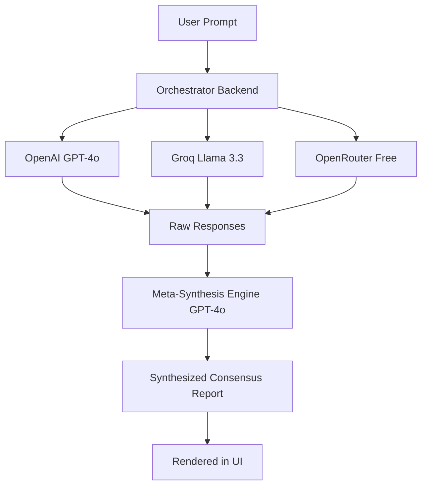

# MultiMind: Multi-Model Self-Consistency Orchestrator

**MultiMind** is a state-of-the-art GenAI multi-model self-consistency orchestrator. It queries multiple independent LLM clusters in parallel, filters out conversational fillers, resolves inconsistencies, and uses a master synthesis optimizer to merge the raw responses into a single, high-fidelity, comprehensive consensus report.

The interface features a beautiful, glassmorphic dashboard styled with a violet-cyan accent gradient and smooth micro-animations, complete with a tactile Light/Dark mode toggler.

---

## Key Features

- **Parallel Model Execution**: Queries three independent endpoints simultaneously:
  - **OpenAI** (GPT-4o)
  - **Groq** (Llama-3.3-70b-versatile)
  - **OpenRouter** (Free Tier Models)
- **Consensus & Synthesis Engine**: Automatically deconstructs prompt parameters, aligns separate technical responses, strips internal system logs, and blends the best analogies, facts, and explanations.
- **Glassmorphism UI**: High-end modern styling featuring radial glow overlays, glass panels with backdrop-blur, pulsing status indicators, and responsive grid layouts.
- **Concentric Neural Loader**: A custom orbital spinner animation representing thoughts aligning to form consensus.
- **Side-by-Side Breakdown**: Easily review the synthesized master report alongside the raw, unmodified responses from each individual model.
- **Tactile Theme Toggler**: Persistent Light/Dark theme slider styled as a clean capsule pill.
- **Historical Query Logs**: Local search log that caches past prompts and consensus reports.

---

## Tech Stack

- **Backend**: Node.js, Express, TypeScript, `tsx` (TypeScript Execute), `@google/generative-ai`, `@anthropic-ai/sdk`, `openai`, `groq-sdk`.
- **Frontend**: Vanilla HTML5, CSS3 Custom Variables (Glassmorphism design system), Native JavaScript, FontAwesome Icons, `marked.js` (Markdown parsing).

---

## Setup & Installation

### 1. Prerequisites
Ensure you have [Node.js](https://nodejs.org/) installed (v18.0.0 or higher is recommended).

### 2. Clone the Repository
```bash
git clone https://github.com/tushar-nebhnani/MultiMind.git
cd MultiMind
```

### 3. Configure Environment Variables
Copy the `.env.example` template to a new file named `.env`:
```bash
cp .env.example .env
```
Open `.env` and fill in your API keys:
```env
PORT=3000

# Enter your OpenAI API Key (used for GPT-4o consensus & synthesis)
OPENAI_API_KEY=sk-proj-...

# Enter your Groq API Key (used for Llama-3.3-70b consensus participant)
GROQ_API_KEY=gsk_...

# Enter your OpenRouter API Key (used for free tier consensus participant)
OPENROUTER_API_KEY=sk-or-v1-...
```

### 4. Install Dependencies
```bash
npm install
```

### 5. Run the Application

#### Development Mode (With Hot Reloading)
```bash
npm run dev
```
Open [http://localhost:3000](http://localhost:3000) in your web browser.

#### Production Build & Start
To compile TypeScript and start the production server:
```bash
npm run build
npm run start
```

---

## How It Works



1. **Parallel Dispatch**: When you enter a prompt, the Express server dispatches requests concurrently to the OpenAI, Groq, and OpenRouter clusters.
2. **Meta-Evaluation Synthesis**: Once the responses are returned, they are bundled together with the original prompt and passed to the Master Synthesis Engine.
3. **Consensus Blending**: The engine acts as a meta-evaluator, identifying logical consensus, extracting the strongest technical details/analogies, and generating a cohesive, human-friendly Markdown output shown in the **Final Answer** tab.
4. **Side-by-Side Breakdowns**: The individual raw outputs are also mapped to the **Model Breakdowns** grid for full transparency.
